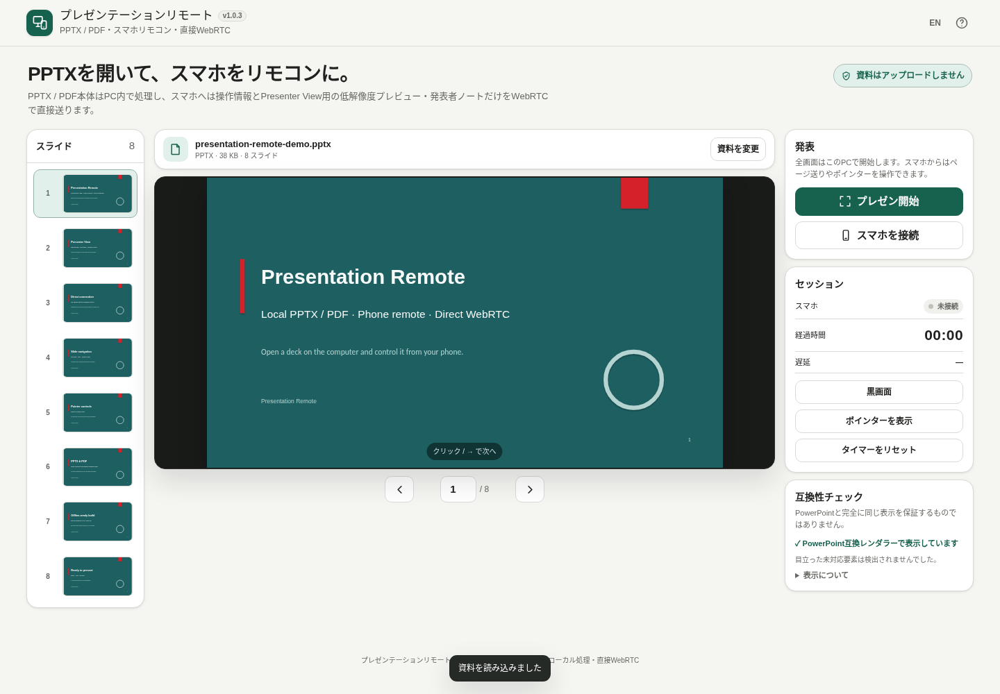

# Presentation Remote

[](https://github.com/ttomohisa/htmlapps-presentation-remote/actions/workflows/deploy-pages.yml)
[](LICENSE)
[](https://ttomohisa.github.io/htmlapps-presentation-remote/)

[English README](README.md)

手元のPPTX / PDFをPCのブラウザーで開き、スマホをWebRTCリモコンとして使えるプレゼンツールです。資料ファイル本体をアップロードせずに利用できます。

## 🚀 デモ

### [GitHub PagesでPresentation Remoteを開く](https://ttomohisa.github.io/htmlapps-presentation-remote/)

GitHub Pagesから最初のHTMLを読み込んだ後、PPTX / PDFの解析とプレゼン表示は発表用PCのブラウザー内で行います。スマホとはWebRTCで直接接続し、操作情報と、Presenter Viewで使う現在 / 次スライドの低解像度プレビュー・発表者ノートだけを送信します。

[](https://ttomohisa.github.io/htmlapps-presentation-remote/)

## 主な機能

- **PPTX / PDFをそのまま発表** — 最大150 MBの資料を、アップロードや変換サービスを使わずPCのブラウザーで開けます。
- **スマホをプレゼンリモコンに** — QRで2台のブラウザーを接続し、戻る / 次へ、黒画面、ポインター、タイマー、スライド直接移動を操作できます。
- **スマホでPresenter View** — 現在スライド、次スライド、PowerPointの発表者ノートを確認しながら操作できます。
- **PowerPoint互換性を重視した表示** — `@aiden0z/pptx-renderer` を主経路にし、開けない資料では互換レンダラーへフォールバックします。
- **発表中の使いやすさを重視** — 接続切れ案内、対応端末でのScreen Wake Lock、タッチ / モーションポインター、左右スワイプ、操作フィードバックに対応します。
- **直接接続の失敗理由を確認** — 接続できない場合は候補ペアの試行数と疎通確認の送受信状況を表示し、端末分離・VPN・ファイアウォールなどの可能性を案内します。
- **単一HTMLで配布可能** — 必要なランタイムはビルド時に内包します。実行時CDN、分析タグ、テレメトリ、シグナリングサーバー、STUN、TURNは使用しません。

## すぐに使う

### Webで使う

発表用PCで [Presentation Remote](https://ttomohisa.github.io/htmlapps-presentation-remote/) を開くだけで利用できます。インストールやアカウント登録は不要です。

スマホ操作を使う場合はスマホでも同じアプリを開き、後述のQR接続を行います。STUN / TURN / シグナリングサーバーを使わないため、基本的にPCとスマホは同じWi-Fi / LANへ接続してください。

### 単一HTMLをビルドして使う

1. Windows 10 / 11でこのリポジトリをダウンロードまたはクローンします。
2. `build-standalone.bat` を実行します。
3. 初回のみ、`dependencies.json` で固定した依存パッケージを取得します。
4. 生成された `dist/index.html` を開きます。

標準ビルドではWindows PowerShellとWindows標準の `tar.exe` を使用します。Node.jsやPythonは不要です。

## 使い方

1. 発表用PCでアプリを開き、PPTXまたはPDFを選択します。
2. 左側のスライド一覧で内容を確認し、全画面にするときは **プレゼン開始** を押します。
3. スマホを接続する場合は、PCで **スマホを接続** を押します。
4. スマホでアプリを開いて **スマホで操作** を選び、PCに表示された接続QRを読み取ります。
5. スマホに返答QRが表示されるので、PCで読み取るとWebRTC接続が完了します。
6. 大きな **次へ**、**戻る**、または左右スワイプでページを移動します。Presenter Viewでは現在 / 次スライドと発表者ノートを確認できます。
7. 上部のスライド番号をタップすると、番号一覧または直接入力でスライドへ移動できます。Presenter View、振動、タイマー、再接続 / 切断は **その他** にまとめています。

### Presenter View

スマホではPresenter Viewが標準でONになります。

- 現在スライドを大きく、次スライドを小さく表示します。
- PowerPointの発表者ノートを開閉できます。
- ノート文字サイズは11〜19 pxで変更でき、そのスマホ内に保存します。
- 長いノートはノート欄だけをスクロールし、主要操作を画面外へ押し出しません。
- PPTXプレビューは可能な限りPC側と同じ主レンダラーから生成し、背景色・文字・図形などの表示経路を揃えています。
- PDFにはPowerPointの発表者ノートがないため、その旨を画面に表示します。

**その他** からPresenter ViewをOFFにすると、プレビューを使わないシンプルなリモコンへ戻せます。

### ポインター操作

スマホから2種類の方法でポインターを操作できます。

- **タッチ** — 指の移動に合わせてポインターを動かします。
- **モーション** — ブラウザー / OSが対応している場合、Device Orientationセンサーでスマホの向きから操作します。

モーションモードには中央合わせ、固定 / 再開、感度、デッドゾーン、手ぶれ補正があります。センサーの利用可否や権限の挙動はブラウザー / OSによって異なります。

### PCのキーボード操作

| ショートカット | 操作 |
| --- | --- |
| `→` / `↓` / `PageDown` / `Space` | 次のスライド |
| `←` / `↑` / `PageUp` | 前のスライド |
| `Home` | 最初のスライド |
| `End` | 最後のスライド |
| `B` | 黒画面の切り替え |
| `F` | 全画面の切り替え |

ブラウザーの制限により、全画面開始には発表用PC側でのユーザー操作が必要です。

## 対応ブラウザー

- Chrome / Edgeを主要対象として確認しています。
- Safariは必要なWebRTC APIが利用できる範囲で基本的なリモコン操作に対応します。Screen Wake Lockやモーションセンサーの挙動はOS / ブラウザーのバージョンに依存します。
- Firefoxでも基本機能が動作する場合がありますが、主要なリリース確認対象ではありません。
- モーションポインターにはDevice Orientation対応とHTTPSなどのセキュアコンテキストが必要です。
- 全画面表示はブラウザー制約により、発表用PC側のユーザー操作が必要です。

## GitHub Pagesで公開する

このリポジトリには、必要な依存を内包した単一HTMLをビルドし、`dist/` をGitHub Pagesへ公開するワークフローが含まれています。

1. リポジトリ名を `htmlapps-presentation-remote` としてGitHubへプッシュします。
2. **Settings → Pages → Build and deployment → Source** で **GitHub Actions** を選択します。
3. `main` へプッシュするか、Actionsから **Deploy standalone app to GitHub Pages** を手動実行します。
4. 成功後、`https://ttomohisa.github.io/htmlapps-presentation-remote/` で利用できます。

ビルド時には `scripts/check-repository.ps1` を実行し、固定依存から単一HTMLを再生成して、リポジトリ構成と生成物を検証してから公開します。

## 開発とビルド

```text
.
├─ src/index.template.html          # アプリ本体テンプレート
├─ components/                      # 共通UI / WebRTCコンポーネント
├─ dependencies.json                # 固定依存と内包対象
├─ app.config.json                  # アプリ情報 / ビルド設定
├─ build-standalone.bat             # Windows用ビルド入口
├─ build-standalone.ps1             # 単一HTMLビルダー
├─ scripts/check-repository.ps1     # リポジトリ / ビルド検証
├─ dist/index.html                  # 生成される単一HTML
└─ .github/workflows/
   ├─ build-standalone.yml          # Pull Request時のビルド検証
   └─ deploy-pages.yml              # mainからPagesへ自動公開
```

### 依存ライブラリを更新する

`dependencies.json` のバージョンと内包パスを更新してから再ビルドします。

キャッシュを破棄して固定パッケージを取得し直す場合:

```powershell
./build-standalone.ps1 -ForceDownload
```

ビルド処理では以下を行います。

- キャッシュにない固定バージョンのnpmパッケージを取得
- 必要なJavaScript、WebAssembly、PDF.js Worker、CMap、標準フォント資産を生成HTMLへ内包
- 設定された資産をgzip圧縮
- 依存関係 / ビルドサイズのマニフェストを生成
- 必須ファイルや共通コンポーネントの契約を検証
- 通常版と自己展開版の単一HTMLを検証

## プライバシーと通信

PPTX / PDFの資料本体は発表用PCのブラウザー内に残り、アプリからサーバーへアップロードしません。

スマホ接続時にPCからスマホへ送信するものは以下です。

- スライド番号やプレゼン状態
- リモコン操作 / ポインター情報
- Presenter ViewをONにしている間の現在 / 次スライドの低解像度プレビュー
- 現在スライドのPowerPoint発表者ノート

これらはWebRTC DataChannelで2台のブラウザー間を直接送信します。Presentation Remoteはシグナリングサーバー、STUN、TURNを使わないため、基本的に同じWi-Fi / LAN内で直接通信できる必要があります。ゲストWi-Fi、端末分離、VPN、ファイアウォールなどでは接続できない場合があります。

GitHub Pages版ではページを開くための最初のHTML通信は発生します。必要なランタイムはHTMLへ内包し、実行時にCDNから読み込みません。

## 制限事項

- PowerPoint互換性を重視して表示しますが、PowerPoint本体ではありません。複雑な効果は差が出る場合があり、アニメーション / 画面切り替えは静止表示です。
- 見た目の厳密な一致が必要な資料では、事前にPDFへ書き出して利用するとより安定します。
- PDFにはPowerPointの発表者ノートはありません。
- 全画面開始はブラウザー制約により発表用PC側で操作する必要があります。
- STUN / TURNによる中継を行わないため、ゲストWi-Fi、端末分離、VPN、厳しいファイアウォール環境ではWebRTC接続できない場合があります。
- Screen Wake Lock、振動、Device Orientation、カメラ権限はブラウザー / OSの対応状況に依存します。
- ページ数が多い資料や複雑なPPTX / PDFでは端末メモリを多く使用します。現在のUIでは1ファイル150 MBまでです。
- Presenter ViewをONにすると低解像度スライドプレビューと発表者ノートをスマホへ送ります。スマホ側に不要な場合はPresenter ViewをOFFにしてください。

## 使用ライブラリ

| ライブラリ | バージョン | ライセンス | 用途 |
| --- | ---: | --- | --- |
| qrcode-generator | 1.4.4 | MIT | 直接接続用QRコード生成 |
| jsQR | 1.4.0 | Apache-2.0 | QRコード読み取りのフォールバック |
| @aiden0z/pptx-renderer | 1.2.4 | Apache-2.0 | PPTX解析 / 主描画 |
| pptx-svg | 0.6.5 | MIT | PPTX互換フォールバック |
| pdfjs-dist | 6.3.289 | Apache-2.0 | PDF解析 / Canvas描画 |

第三者ライブラリの詳細は [THIRD_PARTY_NOTICES.md](THIRD_PARTY_NOTICES.md) を確認してください。

## コントリビューション

バグ報告や機能提案はGitHub Issuesからお願いします。開発への参加方法は [CONTRIBUTING.md](CONTRIBUTING.md) を確認してください。

## ライセンス

Copyright © 2026 ttomohisa

このプロジェクトは [MIT License](LICENSE) で公開されています。
