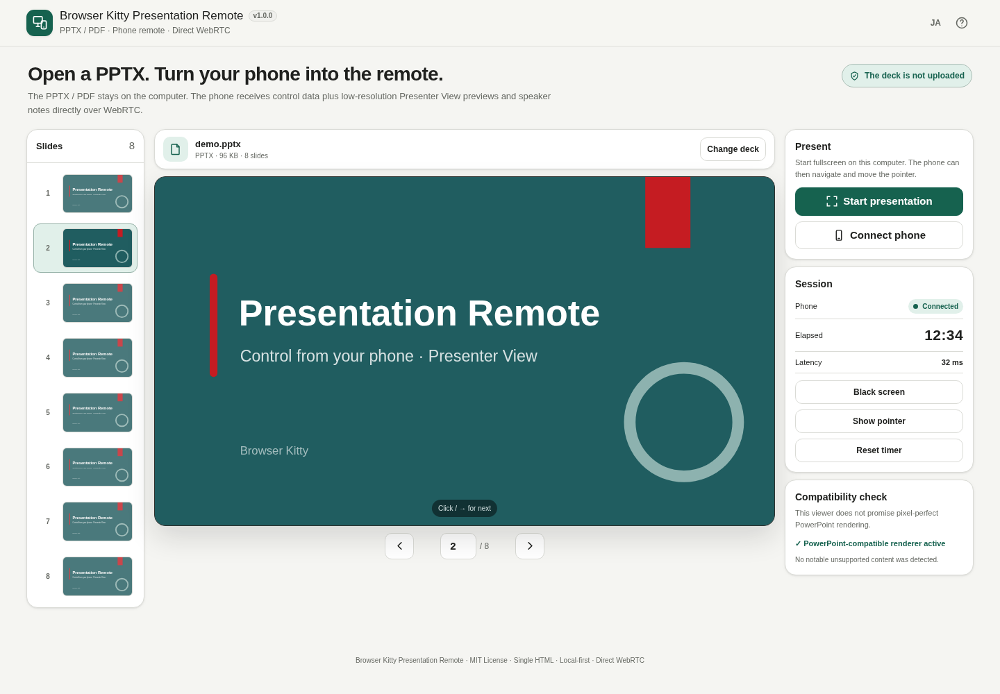

# Browser Kitty Presentation Remote

[](https://github.com/ttomohisa/htmlapps-presentation-remote/actions/workflows/deploy-pages.yml)
[](LICENSE)
[](https://ttomohisa.github.io/htmlapps-presentation-remote/)

[日本語版 README](README.ja.md)

A browser-based presentation tool that opens a local PPTX or PDF on your computer and lets you control it from a phone over direct WebRTC. The source presentation is not uploaded to a server.

## 🚀 Live demo

### [Open Presentation Remote on GitHub Pages](https://ttomohisa.github.io/htmlapps-presentation-remote/)

GitHub Pages delivers the initial HTML. After it loads, PPTX/PDF parsing and presentation rendering run in the presenting computer's browser. The phone connects directly to the computer with WebRTC and receives only presentation controls/state plus the low-resolution current/next slide previews and speaker notes used by Presenter View.

[](https://ttomohisa.github.io/htmlapps-presentation-remote/)

## Features

- **Present local PPTX and PDF files** — Open a presentation up to 150 MB without sending the source file to an upload or conversion service.
- **Use your phone as a remote** — Pair two browsers with QR codes and control Previous / Next, black screen, pointer, timer, and direct slide navigation.
- **Presenter View on the phone** — See the current slide, next slide, and PowerPoint speaker notes while keeping the main controls easy to reach.
- **PowerPoint-oriented rendering** — Use `@aiden0z/pptx-renderer` as the primary PPTX renderer, with a compatibility fallback for decks the primary path cannot open.
- **Built for live presentation use** — Includes reconnect guidance, Screen Wake Lock when available, touch/motion pointer modes, swipe navigation, and command feedback.
- **Single-HTML distribution** — Runtime libraries are embedded at build time. No runtime CDN, analytics, telemetry, signaling server, STUN, or TURN is required.

## Quick start

### Use the web demo

Open [Presentation Remote](https://ttomohisa.github.io/htmlapps-presentation-remote/) on the presenting computer. No installation or account is required.

For phone control, open the same app on the phone and follow the QR pairing flow described below. Both devices normally need to be on the same Wi-Fi / LAN because pairing does not use STUN, TURN, or a signaling server.

### Build a standalone HTML file

1. Download or clone this repository on Windows 10 / 11.
2. Run `build-standalone.bat`.
3. The first build downloads the exact dependency versions pinned in `dependencies.json`.
4. Open the generated `dist/index.html`.

The build uses Windows PowerShell and the built-in `tar.exe`. Node.js and Python are not required for the standard build.

## Usage

1. Open the app on the presenting computer and choose a PPTX or PDF file.
2. Use the slide list to confirm the deck, then choose **Start presentation** when you are ready to enter fullscreen.
3. To connect a phone, choose **Connect phone** on the computer.
4. On the phone, open the app and choose **Use as remote**, then scan the connection QR shown by the computer.
5. The phone displays a response QR. Scan that QR with the computer to complete the direct WebRTC connection.
6. Use the large **Next** button, **Previous**, or a horizontal swipe to move through the presentation. Presenter View shows the current/next slide and speaker notes.
7. Tap the slide counter to jump directly to another slide. Use **More** for Presenter View, vibration feedback, timer, and reconnect/disconnect actions.

### Presenter View

Presenter View is enabled by default on the phone.

- The current slide is shown larger than the next slide.
- PowerPoint speaker notes can be expanded or collapsed.
- Note text size can be adjusted from 11–19 px and is remembered on that phone.
- Long notes scroll inside the note area instead of pushing the main controls off-screen.
- PPTX previews use the same primary rendering path as the computer whenever possible so colors, text, shapes, and backgrounds remain consistent.
- PDF files do not contain PowerPoint speaker notes; the app states this explicitly.

Presenter View can be disabled from **More** to return to the simpler remote layout.

### Pointer controls

The phone can control a presentation pointer in two ways:

- **Touch** — Move the pointer directly with your finger.
- **Motion** — Use Device Orientation when the browser and operating system allow sensor access.

Motion mode includes calibration, Freeze / Resume, sensitivity, dead zone, and stabilization controls. Sensor availability and permission behavior vary by browser and OS.

### Keyboard shortcuts on the presenting computer

| Shortcut | Action |
| --- | --- |
| `→` / `↓` / `PageDown` / `Space` | Next slide |
| `←` / `↑` / `PageUp` | Previous slide |
| `Home` | First slide |
| `End` | Last slide |
| `B` | Toggle black screen |
| `F` | Toggle fullscreen |

Browsers require fullscreen to be started by a user action on the presenting computer.

## Browser support

- Chrome and Edge are the primary supported browsers.
- Safari can use the core remote features where the required WebRTC APIs are available; Screen Wake Lock and motion-sensor behavior depend on the OS/browser version.
- Firefox may support the basic presentation flow, but it is not a primary release-test target.
- Motion pointer requires Device Orientation support and a secure context such as HTTPS.
- Fullscreen always requires a user action on the presenting computer.

## Publish with GitHub Pages

The repository includes a workflow that builds the embedded standalone HTML and deploys `dist/` to GitHub Pages.

1. Push the repository to GitHub as `htmlapps-presentation-remote`.
2. Open **Settings → Pages → Build and deployment → Source** and choose **GitHub Actions**.
3. Push to `main`, or manually run **Deploy standalone app to GitHub Pages** from the Actions tab.
4. After a successful deployment, the app is available at `https://ttomohisa.github.io/htmlapps-presentation-remote/`.

Each build runs `scripts/check-repository.ps1`, rebuilds the single HTML from pinned dependencies, verifies the repository/standalone contracts, and then publishes the result.

## Development and build layout

```text
.
├─ src/index.template.html          # Application template
├─ components/                      # Shared UI / WebRTC components
├─ dependencies.json                # Pinned runtime dependencies and embedded assets
├─ app.config.json                  # App metadata and build settings
├─ build-standalone.bat             # Windows build entry point
├─ build-standalone.ps1             # Standalone HTML builder
├─ scripts/check-repository.ps1     # Repository + build verification
├─ dist/index.html                  # Generated standalone app
└─ .github/workflows/
   ├─ build-standalone.yml          # Pull request build validation
   └─ deploy-pages.yml              # Automatic Pages deployment from main
```

### Update dependencies

Edit the exact versions and asset paths in `dependencies.json`, then rebuild.

To discard the local package cache and download the pinned packages again:

```powershell
./build-standalone.ps1 -ForceDownload
```

The build process:

- Downloads the pinned npm package versions when they are not already cached.
- Embeds the required JavaScript, WebAssembly, PDF.js worker, CMaps, and standard-font assets into the generated HTML.
- Gzip-compresses configured embedded assets.
- Writes dependency and build-size manifests.
- Verifies required repository files and shared component contracts.
- Verifies the standalone and self-extracting HTML outputs.

## Privacy and networking

The PPTX / PDF source file stays in the presenting computer's browser. The app does not upload that source file to a server.

When a phone is connected, the phone receives:

- slide number and presentation state
- remote-control and pointer messages
- while Presenter View is enabled, low-resolution previews of the current and next slides
- PowerPoint speaker notes for the current slide

Those messages are sent directly between the two browsers over WebRTC DataChannels. Presentation Remote does not use a signaling server, STUN, or TURN, so direct reachability on the same Wi-Fi / LAN is normally required. Guest Wi-Fi isolation, VPNs, firewalls, and network client isolation can prevent pairing.

The GitHub Pages version still requires the initial HTML request. Runtime libraries are embedded and are not loaded from a CDN.

## Limitations

- PowerPoint rendering is designed for visual compatibility, but it is not PowerPoint itself. Complex effects can differ, and animations / transitions are shown as static slides.
- If exact PowerPoint appearance is essential, exporting the deck to PDF first can provide more predictable results.
- PDF files do not provide PowerPoint speaker notes.
- Fullscreen must be started by a user action on the presenting computer because of browser restrictions.
- Direct WebRTC pairing may fail on guest Wi-Fi, isolated networks, VPNs, or restrictive firewalls because there is no STUN/TURN relay.
- Screen Wake Lock, vibration, Device Orientation, and camera permissions depend on browser and OS support.
- Large or complex PPTX/PDF files can use substantial device memory. The current UI accepts files up to 150 MB.
- The phone receives low-resolution slide previews and speaker notes while Presenter View is enabled; disable Presenter View if those are not needed on the phone.

## Dependencies

| Library | Version | License | Purpose |
| --- | ---: | --- | --- |
| qrcode-generator | 1.4.4 | MIT | QR code generation for direct pairing |
| jsQR | 1.4.0 | Apache-2.0 | QR code decoding fallback |
| @aiden0z/pptx-renderer | 1.2.4 | Apache-2.0 | Primary PPTX parsing and browser rendering |
| pptx-svg | 0.6.5 | MIT | PPTX compatibility fallback |
| pdfjs-dist | 6.3.289 | Apache-2.0 | PDF parsing and Canvas rendering |

See [THIRD_PARTY_NOTICES.md](THIRD_PARTY_NOTICES.md) for third-party notices.

## Contributing

Bug reports and feature proposals are welcome through GitHub Issues. See [CONTRIBUTING.md](CONTRIBUTING.md) for development guidance.

## License

Copyright © 2026 ttomohisa

Licensed under the [MIT License](LICENSE).
